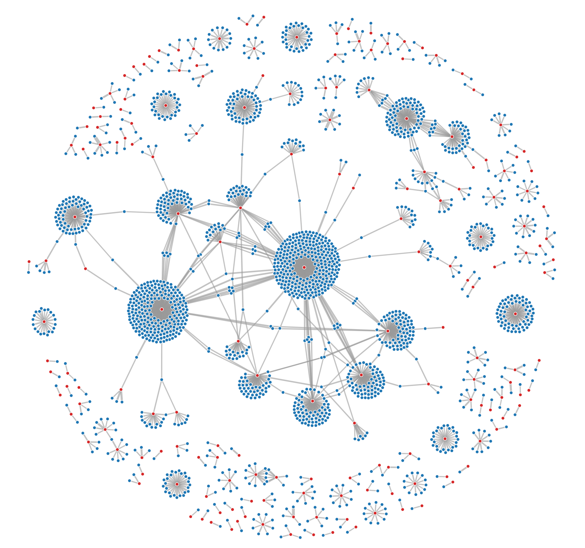

# ADEX
## Purpose
An independent public authority of a scientific nature, the Haute Autorité de santé (HAS) works to guarantee quality in the health, social and medico-social fields, for the benefit of people.

In order to carry out its missions, the HAS collaborates daily with experts for the evaluation of health products, the development of recommendations for professionals, etc. However, to guarantee public health, the institution must ensure the independence and impartiality of the opinions delivered. The analysis of the links of interest of the experts with whom it collaborates (links they would have with people, organizations or companies ...) is therefore essential.

## How?
Using a full .Net core solution. This set of projects is meant to exploit gigabytes of data from import to restitution.

Two datamodels are tested. The normalized one uses one class per entity. The metamodel one uses the principle of one table for all (nearly all) entities. All the data is stored in some tables that do not represent the model itself.

